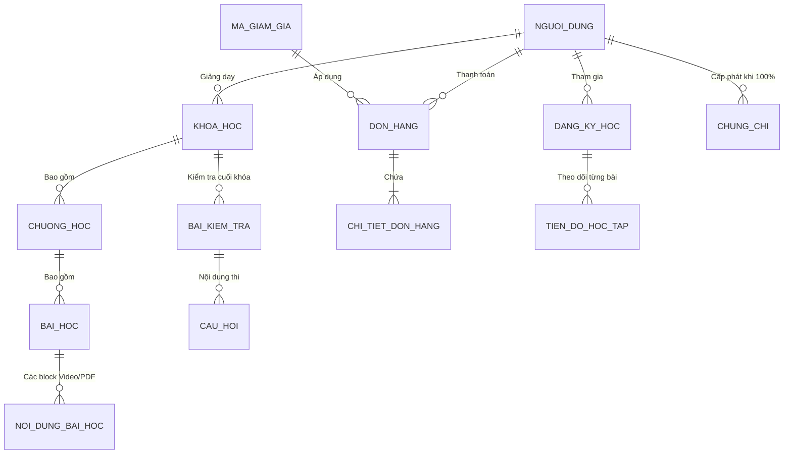

# Hệ Thống Đăng Ký Khóa Học Trực Tuyến (Lumina LMS)


## 📖 Giới thiệu Dự án
**Lumina LMS** là một nền tảng Quản lý Học tập (Learning Management System) toàn diện, được xây dựng dựa trên kiến trúc Client-Server hiện đại. Hệ thống đóng vai trò như một cầu nối thương mại điện tử giáo dục, cho phép các chuyên gia (Giảng viên) đóng gói kiến thức thành các khóa học đa phương tiện và bán cho người có nhu cầu học tập (Học viên).

Dự án chú trọng vào trải nghiệm học tập xuyên suốt: từ lúc khám phá tìm kiếm khóa học, thanh toán, tham gia không gian học tập trực tuyến, cho đến việc làm bài đánh giá và tự động cấp chứng chỉ số.

---

## ✨ Tính năng Nổi bật (Core Features)

Hệ thống phân chia quyền hạn rõ ràng với 3 vai trò chính:

### 🎓 Dành cho Học viên (Learners)
- **Khám phá & Tìm kiếm:** Lọc khóa học theo danh mục, giá tiền (miễn phí/trả phí), trình độ (cơ bản/nâng cao), đánh giá sao, và sắp xếp linh hoạt.
- **Mua sắm & Thanh toán:** Quản lý giỏ hàng (Cart), áp dụng mã giảm giá (Coupons) linh hoạt theo % hoặc số tiền cố định, tích hợp thanh toán an toàn.
- **Không gian học tập (Learn Space):** 
  - Giao diện học tập tập trung, không phân tâm.
  - Hỗ trợ đa dạng nội dung: **Video (MP4), Tài liệu (PDF), Văn bản phong phú, Code snippets**.
  - Tự động lưu tiến độ học tập (ghi nhớ số giây đang xem dở trên video).
- **Trắc nghiệm & Đánh giá (Quizzes):** Làm bài kiểm tra tính thời gian, tự động chấm điểm dựa trên ngân hàng câu trả lời.
- **Chứng nhận Tốt nghiệp:** Tự động sinh file PDF **Chứng chỉ (Certificate)** khi hoàn thành 100% tiến độ và đạt bài kiểm tra. Có link/mã UUID để nhà tuyển dụng xác thực online.
- **Tương tác:** Chấm điểm, đánh giá (Review) khóa học và lưu trữ khóa học vào Danh sách yêu thích (Wishlist).

### 👨‍🏫 Dành cho Giảng viên (Instructors)
- **Instructor Studio:** Bảng điều khiển riêng biệt dành cho người dạy.
- **Xây dựng Giáo trình Đa phương tiện:**
  - Tạo cấu trúc Khóa học -> Chương học -> Bài học.
  - Tải lên (Upload) video, PDF an toàn (lưu trữ thông qua MinIO Private Storage).
  - Cấu hình cho phép "Học thử" (Preview) một số bài giảng để thu hút học viên.
- **Quản lý Học viên:** Xem danh sách học viên đang theo học các khóa của mình.
- **Tài chính & Rút tiền:** Theo dõi doanh thu từ các lượt mua, tạo **Yêu cầu rút tiền (Payout Request)** chuyển về tài khoản ngân hàng.

### 🛡️ Dành cho Quản trị viên (Admin)
- **Kiểm duyệt nội dung:** Bật/Tắt trạng thái xuất bản của các khóa học, bài học để đảm bảo chất lượng nền tảng.
- **Quản lý Tài khoản:** Quản lý học viên, giảng viên.
- **Quản lý Khuyến mãi:** Sinh mã Coupon, giới hạn số lượt sử dụng, đặt ngày hết hạn.
- **Quản lý Giao diện:** Thiết lập hệ thống (Settings), quản lý Banner băng chuyền trang chủ.
- **Báo cáo & Nhật ký:** Xem biểu đồ tổng quan, kiểm tra lịch sử thao tác của hệ thống (Admin Logs).

---

## 🛠️ Công nghệ Sử dụng (Tech Stack)

Dự án áp dụng các công nghệ mới nhất trong hệ sinh thái Python và JavaScript/TypeScript.

### Tầng Backend (RESTful API)
- **Framework:** [FastAPI](https://fastapi.tiangolo.com/) (Python) - Nhanh, hiện đại, hỗ trợ Auto-docs (Swagger UI).
- **Cơ sở dữ liệu:** PostgreSQL kết hợp thư viện bất đồng bộ `asyncpg`.
- **ORM & Migration:** SQLAlchemy 2.0 & Alembic.
- **Caching & Queue:** Redis (Lưu trữ session, bộ nhớ đệm).
- **Lưu trữ Object Storage:** MinIO (S3-Compatible) - Quản lý an toàn file PDF, Video bài giảng.
- **Bảo mật:** JWT (JSON Web Tokens), mã hóa mật khẩu Passlib, Role-Based Access Control (RBAC).

### Tầng Frontend (Client UI)
- **Framework:** [Next.js 16](https://nextjs.org/) (Sử dụng App Router hiện đại).
- **Core Library:** React 19, TypeScript.
- **Giao diện & Styling:** Tailwind CSS v4, Lucide React (Icons).
- **Rich Text Editor:** CKEditor 5 (Cho phép Giảng viên soạn thảo mô tả khóa học đẹp mắt).
- **Tính năng Kéo-Thả:** `@hello-pangea/dnd` (Dùng để sắp xếp thứ tự Chương/Bài học).

### DevOps & Triển khai
- Docker & Docker Compose (Container hóa toàn bộ Postgres, Redis, MinIO, FastAPI).

---

## 🏗️ Kiến trúc Hệ thống (Architecture)

### 1. Kiến trúc Backend Phân lớp (Layered Architecture)
Mã nguồn Backend (`lms-backend/app/`) được tổ chức thành các tầng rõ ràng nhằm đảm bảo tính tái sử dụng và dễ bảo trì:
- `api/v1/`: Tầng **Routing** (Tiếp nhận HTTP Request, Validate sơ bộ).
- `services/`: Tầng **Logic Nghiệp vụ** (Business Logic) cốt lõi (vd: Tính toán giá tiền, Cấp chứng chỉ).
- `schemas/`: Tầng **DTO** (Sử dụng Pydantic) kiểm tra tính hợp lệ của dữ liệu đầu vào và định hình dữ liệu đầu ra.
- `models/`: Tầng **Dữ liệu** (SQLAlchemy Entities) ánh xạ trực tiếp xuống PostgreSQL.

### 2. Sơ đồ Thực thể Liên kết (ERD) Tổng quát
*(Xem hình dưới đây trên các trình đọc Markdown hỗ trợ Mermaid)*



---

## 🚀 Hướng dẫn Cài đặt Môi trường Cục bộ (Local Setup)

### Bước 1: Khởi động các dịch vụ phụ trợ (Postgres, Redis, MinIO)
Đảm bảo bạn đã cài đặt Docker.
```bash
# Mở terminal tại thư mục gốc của dự án
docker-compose up -d postgres redis minio
```

### Bước 2: Khởi chạy Backend (FastAPI)
```bash
cd lms-backend

# Tạo và kích hoạt môi trường ảo (Virtual Env)
python -m venv .venv
source .venv/Scripts/activate  # (Windows)
# source .venv/bin/activate    # (Mac/Linux)

# Cài đặt thư viện
pip install -r requirements.txt

# Tạo file .env từ template (và cấu hình Database URL, Secret Key)
# Chạy Migration tạo bảng Database
alembic upgrade head

# Chạy Server Backend (Mặc định ở http://localhost:8000)
uvicorn app.main:app --host 0.0.0.0 --port 8000 --reload
```
*Ghi chú: Tài liệu API tương tác tự động có sẵn tại: `http://localhost:8000/docs`*

### Bước 3: Khởi chạy Frontend (Next.js)
```bash
cd lms-frontend

# Cài đặt thư viện
npm install

# Khởi chạy chế độ Development (Mặc định ở http://localhost:3000)
npm run dev
```

---

## 🔒 Tài khoản Mặc định (Mock Data)
Để dễ dàng kiểm thử, bạn có thể tạo tài khoản Admin trực tiếp thông qua Swagger UI hoặc Database:
- **Trang chủ:** `http://localhost:3000`
- **CMS Quản trị:** `http://localhost:3000/admin`
- **Dashboard Giảng viên:** `http://localhost:3000/instructor/dashboard`

---

## 📄 Giấy phép (License)
Dự án được xây dựng phục vụ cho mục đích Đồ án/Giáo dục. 
Tác giả: **Hoàng Đức Thịnh**