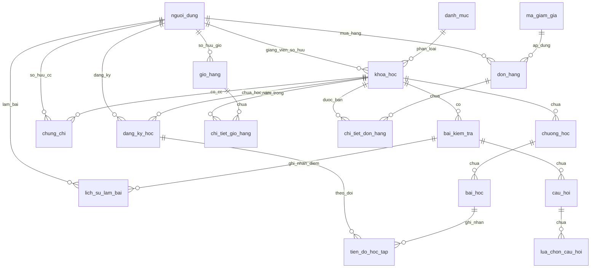

# Tài liệu Đặc tả Thiết kế Hệ thống LMS Backend

Tài liệu này cung cấp mô tả chi tiết và đầy đủ về thiết kế Cơ sở dữ liệu (PostgreSQL), kiến trúc Cổng kết nối API (FastAPI) và phân tích các quy tắc logic nghiệp vụ nâng cao được triển khai trong hệ thống LMS (Learning Management System) Backend.

---

## 1. Thiết kế Cơ sở dữ liệu (Database Design)

Hệ thống cơ sở dữ liệu được thiết kế và chuẩn hóa hoàn toàn theo các tiêu chuẩn **1NF, 2NF, và 3NF** nhằm đảm bảo tính toàn vẹn dữ liệu, loại bỏ dữ liệu dư thừa và tối ưu hóa hiệu năng truy vấn. Hệ thống bao gồm **17 bảng quan hệ logic** chặt chẽ:

### Sơ đồ quan hệ thực thể (ERD - Entity Relationship Diagram)

### Mô tả chi tiết các bảng trong Database

#### 1. Bảng `nguoi_dung` (User)
Lưu trữ thông tin tài khoản người dùng trong hệ thống (Học viên, Giảng viên, Quản trị viên).
*   `id` (int, Primary Key, Auto Increment)
*   `ho_ten` (varchar(255), Not Null): Họ và tên người dùng.
*   `email` (varchar(255), Unique, Not Null): Địa chỉ email đăng nhập.
*   `mat_khau` (varchar(255), Not Null): Mật khẩu đã được mã hóa bằng thuật toán bcrypt.
*   `vai_tro` (varchar(50), Not Null): Vai trò trên hệ thống (`student`, `instructor`, `admin`).
*   `ngay_tao` (datetime, Default func.now()): Thời điểm tạo tài khoản.

#### 2. Bảng `danh_muc` (Category)
Phân loại chủ đề/lĩnh vực của khóa học.
*   `id` (int, Primary Key, Auto Increment)
*   `ten_danh_muc` (varchar(255), Not Null): Tên danh mục.
*   `mo_ta` (text, Nullable): Mô tả chi tiết danh mục.

#### 3. Bảng `khoa_hoc` (Course)
Lưu trữ thông tin chi tiết về khóa học trực tuyến.
*   `id` (int, Primary Key, Auto Increment)
*   `ma_giang_vien` (int, Foreign Key -> `nguoi_dung.id`, Set Null): Giảng viên sở hữu khóa học.
*   `ma_danh_muc` (int, Foreign Key -> `danh_muc.id`, Set Null): Danh mục phân loại khóa học.
*   `tieu_de` (varchar(255), Not Null): Tiêu đề khóa học.
*   `mo_ta` (text, Nullable): Mô tả chi tiết.
*   `gia_tien` (numeric(10, 2), Default 0.00): Giá bán của khóa học.
*   `trinh_do` (varchar(50), Default 'beginner'): Trình độ yêu cầu (`beginner`, `intermediate`, `advanced`).
*   `da_xuat_ban` (boolean, Default False): Trạng thái xuất bản để hiển thị công khai.
*   `danh_gia_trung_binh` (numeric(3, 2), Default 0.00): Điểm đánh giá trung bình từ học viên.
*   `ngay_tao` (datetime, Default func.now())

#### 4. Bảng `chuong_hoc` (Section)
Các chương học chính chia nhỏ nội dung của khóa học.
*   `id` (int, Primary Key, Auto Increment)
*   `ma_khoa_hoc` (int, Foreign Key -> `khoa_hoc.id`, Cascade): Thuộc khóa học nào.
*   `tieu_de` (varchar(255), Not Null): Tiêu đề chương học.
*   `thu_tu` (int, Not Null): Thứ tự sắp xếp của chương trong đề cương khóa học.

#### 5. Bảng `bai_hoc` (Lesson)
Các bài học chi tiết dạng Video, Văn bản hoặc Tài liệu nằm trong chương.
*   `id` (int, Primary Key, Auto Increment)
*   `ma_chuong_hoc` (int, Foreign Key -> `chuong_hoc.id`, Cascade): Thuộc chương học nào.
*   `tieu_de` (varchar(255), Not Null): Tiêu đề bài học.
*   `loai_noi_dung` (varchar(50), Nullable): Phân loại định dạng bài học (`VIDEO`, `DOCUMENT`, `TEXT`).
*   `duong_dan_noi_dung` (varchar(255), Nullable): Đường dẫn nội dung văn bản.
*   `duong_dan_video` (varchar(255), Nullable): Đường dẫn video phát bài học.
*   `duong_dan_tai_lieu` (varchar(255), Nullable): Đường dẫn tài liệu đính kèm tải xuống.
*   `thoi_luong` (int, Default 0): Thời lượng bài học tính bằng giây.
*   `thu_tu` (int, Not Null): Thứ tự sắp xếp bài học trong chương học.
*   `xem_truoc` (boolean, Default False): Đánh dấu bài học cho phép xem thử miễn phí.

#### 6. Bảng `dang_ky_hoc` (Enrollment)
Ghi nhận quyền sở hữu khóa học của học viên sau khi thanh toán thành công.
*   `id` (int, Primary Key, Auto Increment)
*   `ma_nguoi_dung` (int, Foreign Key -> `nguoi_dung.id`, Cascade): Học viên tham gia học.
*   `ma_khoa_hoc` (int, Foreign Key -> `khoa_hoc.id`, Cascade): Khóa học đăng ký.
*   `ngay_dang_ky` (datetime, Default func.now())

#### 7. Bảng `tien_do_hoc_tap` (LearningProgress)
Theo dõi chi tiết tiến độ hoàn thành từng bài học của học viên.
*   `id` (int, Primary Key, Auto Increment)
*   `ma_dang_ky_hoc` (int, Foreign Key -> `dang_ky_hoc.id`, Cascade): Bản ghi ghi danh liên quan.
*   `ma_bai_hoc` (int, Foreign Key -> `bai_hoc.id`, Cascade): Bài học ghi nhận tiến độ.
*   `da_hoan_thanh` (boolean, Default False): Trạng thái học viên đã hoàn thành bài học này chưa.
*   `ngay_hoan_thanh` (datetime, Nullable): Ngày đánh dấu hoàn thành bài học.

#### 8. Bảng `bai_kiem_tra` (Quiz)
Thiết lập các bài thi/kiểm tra trắc nghiệm cuối khóa học.
*   `id` (int, Primary Key, Auto Increment)
*   `ma_khoa_hoc` (int, Foreign Key -> `khoa_hoc.id`, Cascade): Thuộc khóa học nào.
*   `tieu_de` (varchar(255), Not Null): Tiêu đề bài kiểm tra.
*   `diem_dat` (numeric(4, 2), Default 5.0): Điểm tối thiểu để thi đỗ (Hệ số 10).
*   `thoi_gian_lam_bai` (int, Nullable): Giới hạn thời gian thi tính bằng phút.
*   `so_luot_lam_toi_da` (int, Default 3): Số lượt nộp bài tối đa được phép thực hiện.
*   `ngay_tao` (datetime, Default func.now())

#### 9. Bảng `cau_hoi` (Question)
Các câu hỏi trắc nghiệm nằm trong đề thi.
*   `id` (int, Primary Key, Auto Increment)
*   `ma_bai_kiem_tra` (int, Foreign Key -> `bai_kiem_tra.id`, Cascade): Thuộc bài kiểm tra nào.
*   `noi_dung` (text, Not Null): Nội dung văn bản câu hỏi.
*   `diem_so` (int, Default 1): Trọng số điểm của câu hỏi.
*   `giai_thich` (text, Nullable): Gợi ý giải thích đáp án sau khi nộp bài thi.

#### 10. Bảng `lua_chon_cau_hoi` (QuestionOption)
Các phương án đáp án lựa chọn của một câu hỏi trắc nghiệm (Chuẩn hóa 1NF loại bỏ mảng/JSONB).
*   `id` (int, Primary Key, Auto Increment)
*   `ma_cau_hoi` (int, Foreign Key -> `cau_hoi.id`, Cascade): Thuộc câu hỏi nào.
*   `noi_dung_lua_chon` (text, Not Null): Văn bản phương án trả lời.
*   `la_dap_an_dung` (boolean, Default False): Đánh dấu phương án chính xác.

#### 11. Bảng `lich_su_lam_bai` (QuizAttempt)
Nhật ký kết quả chi tiết từng lượt làm bài thi trắc nghiệm của học viên.
*   `id` (int, Primary Key, Auto Increment)
*   `ma_nguoi_dung` (int, Foreign Key -> `nguoi_dung.id`, Cascade): Học viên làm bài.
*   `ma_bai_kiem_tra` (int, Foreign Key -> `bai_kiem_tra.id`, Cascade): Bài thi thực hiện.
*   `diem_dat_duoc` (numeric(4, 2), Not Null): Điểm số chấm được (Hệ 10).
*   `da_qua_mon` (boolean, Not Null): Kết quả Đạt hoặc Không Đạt.
*   `ngay_lam_bai` (datetime, Default func.now())

#### 12. Bảng `gio_hang` (Cart)
Giỏ hàng hiện tại của người dùng.
*   `id` (int, Primary Key, Auto Increment)
*   `ma_nguoi_dung` (int, Foreign Key -> `nguoi_dung.id`, Cascade, Unique): Học viên sở hữu giỏ hàng.

#### 13. Bảng `chi_tiet_gio_hang` (CartItem)
Danh sách các khóa học đang nằm trong giỏ hàng.
*   `id` (int, Primary Key, Auto Increment)
*   `ma_gio_hang` (int, Foreign Key -> `gio_hang.id`, Cascade): Giỏ hàng liên kết.
*   `ma_khoa_hoc` (int, Foreign Key -> `khoa_hoc.id`, Cascade): Khóa học được chọn.

#### 14. Bảng `don_hang` (Order)
Quản lý thông tin đơn mua khóa học và tích hợp thông tin thanh toán (Tránh liên kết 1-1 thừa với bảng thanh toán riêng biệt).
*   `id` (int, Primary Key, Auto Increment)
*   `ma_nguoi_dung` (int, Foreign Key -> `nguoi_dung.id`, Set Null): Người thực hiện mua.
*   `ma_giam_gia_id` (int, Foreign Key -> `ma_giam_gia.id`, Set Null): Mã coupon áp dụng giảm giá.
*   `tong_tien` (numeric(10, 2), Not Null): Tổng số tiền thanh toán cuối cùng sau ưu đãi.
*   `trang_thai` (varchar(50), Default 'pending'): Trạng thái thanh toán (`pending`, `success`, `failed`).
*   `ngay_tao` (datetime, Default func.now())
*   `phuong_thuc_thanh_toan` (varchar(50), Nullable): Cổng thanh toán (`momo`, `vnpay`, `stripe`).
*   `ma_giao_dich` (varchar(255), Nullable): Mã giao dịch đối chiếu từ cổng thanh toán.
*   `ngay_thanh_toan` (datetime, Nullable): Ngày giờ giao dịch thành công.

#### 15. Bảng `chi_tiet_don_hang` (OrderItem)
Lưu vết các sản phẩm khóa học và giá bán tại thời điểm mua trong hóa đơn.
*   `id` (int, Primary Key, Auto Increment)
*   `ma_don_hang` (int, Foreign Key -> `don_hang.id`, Cascade): Đơn hàng liên kết.
*   `ma_khoa_hoc` (int, Foreign Key -> `khoa_hoc.id`, Set Null): Khóa học đã mua.
*   `gia_luc_mua` (numeric(10, 2), Not Null): Giá tiền khóa học ghi nhận tại thời điểm mua.

#### 16. Bảng `ma_giam_gia` (Coupon)
Thông tin mã coupon khuyến mãi cho đơn hàng.
*   `id` (int, Primary Key, Auto Increment)
*   `ma_code` (varchar(50), Unique, Not Null): Chuỗi mã giảm giá (ví dụ: `FIXED50`).
*   `loai_giam_gia` (varchar(50), Default 'PERCENTAGE'): Phân loại giảm theo % (`PERCENTAGE`) hoặc số tiền cố định (`FIXED_AMOUNT`).
*   `gia_tri_giam` (numeric(10, 2), Not Null): Trị giá giảm trừ (% hoặc số tiền cụ thể).
*   `gia_tri_don_toi_thieu` (numeric(10, 2), Default 0.00): Điều kiện giá trị đơn hàng tối thiểu để áp dụng coupon.
*   `so_luot_dung_toi_da` (int, Nullable): Giới hạn số lượt sử dụng của mã trên hệ thống.
*   `so_luot_da_dung` (int, Default 0): Tổng số lượt đã áp dụng thành công trên thực tế.
*   `ngay_het_han` (datetime, Nullable): Ngày hết hiệu lực của mã.

#### 17. Bảng `chung_chi` (Certificate)
Chứng nhận số hoàn thành khóa học được cấp tự động.
*   `id` (int, Primary Key, Auto Increment)
*   `ma_nguoi_dung` (int, Foreign Key -> `nguoi_dung.id`, Cascade): Học viên được cấp phát.
*   `ma_khoa_hoc` (int, Foreign Key -> `khoa_hoc.id`, Cascade): Khóa học tương ứng.
*   `uuid` (varchar(255), Unique): Mã xác thực duy nhất định dạng UUIDv4.
*   `duong_dan_chung_chi` (varchar(255), Not Null): Đường dẫn tệp tin chứng chỉ.
*   `ngay_cap` (datetime, Default func.now())

---

## 2. Thiết kế Cổng kết nối API (API Endpoints Design)

Hệ thống API sử dụng cấu trúc định tuyến phân cấp thông qua `APIRouter` của FastAPI và được gộp lại tại tiền tố `/api/v1`.

### Danh sách các API theo phân hệ nghiệp vụ

| Phân hệ (Tag) | Phương thức | Đường dẫn API | Xác thực | Mô tả chức năng |
| :--- | :---: | :--- | :---: | :--- |
| **Health Check** | `GET` | `/` | Không | Kiểm tra trạng thái máy chủ. |
| **Authentication** | `POST` | `/api/v1/auth/register` | Không | Đăng ký tài khoản mới (Học viên/Giảng viên/Admin). |
| | `POST` | `/api/v1/auth/login` | Không | Đăng nhập nhận Token JWT (Dành cho Frontend). |
| | `POST` | `/api/v1/auth/login/swagger` | Không | Cổng xác thực tương thích nút Authorize của Swagger UI. |
| | `GET` | `/api/v1/auth/profile` | JWT | Lấy thông tin tài khoản hiện tại đang đăng nhập. |
| **Courses & Content**| `POST` | `/api/v1/categories` | Admin | Tạo danh mục khóa học mới. |
| | `GET` | `/api/v1/categories` | Không | Lấy danh sách danh mục hiện có. |
| | `POST` | `/api/v1/instructor/courses` | Instructor| Tạo khóa học mới (trạng thái bản nháp). |
| | `GET` | `/api/v1/instructor/courses` | Instructor| Lấy danh sách khóa học do giảng viên hiện tại quản lý. |
| | `PUT` | `/api/v1/courses/{course_id}`| Instructor| Cập nhật thông tin khóa học (Tiêu đề, giá, xuất bản). |
| | `POST` | `/api/v1/courses/{course_id}/sections`| Instructor| Thêm chương học mới vào khóa học. |
| | `POST` | `/api/v1/sections/{section_id}/lessons`| Instructor| Thêm bài học mới vào chương học. |
| | `PUT` | `/api/v1/lessons/{lesson_id}`| Instructor| Cập nhật thông tin, nội dung bài học. |
| | `DELETE`| `/api/v1/lessons/{lesson_id}`| Instructor| Xóa bài học khỏi chương học. |
| | `GET` | `/api/v1/courses` | Không | Tìm kiếm, lọc và sắp xếp danh sách khóa học công khai. |
| | `GET` | `/api/v1/courses/{course_id}`| Không | Xem đề cương chi tiết của khóa học (công khai). |
| **Shopping Cart** | `GET` | `/api/v1/cart` | Student | Xem chi tiết giỏ hàng hiện tại kèm tổng tiền tạm tính. |
| | `POST` | `/api/v1/cart/items` | Student | Thêm khóa học vào giỏ hàng. |
| | `DELETE`| `/api/v1/cart/items/{course_id}`| Student | Xóa một khóa học ra khỏi giỏ hàng. |
| **Checkout & Payments**| `POST` | `/api/v1/coupons/apply` | Student | Kiểm tra và áp dụng thử mã giảm giá cho giỏ hàng. |
| | `POST` | `/api/v1/admin/coupons` | Admin | Tạo mã giảm giá mới (PERCENT hoặc FIXED_AMOUNT). |
| | `POST` | `/api/v1/checkout` | Student | Đặt hàng (chốt giỏ hàng tạo đơn hàng PENDING). |
| | `GET` | `/api/v1/my-orders` | Student | Xem lịch sử các đơn hàng cá nhân. |
| | `POST` | `/api/v1/payments/mock` | Student | Giả lập thanh toán trực tuyến của đơn hàng. |
| | `POST` | `/api/v1/payments/webhook` | Không | Webhook nhận tín hiệu thanh toán tự động (IPN Webhook). |
| **Learning & Progress**| `GET` | `/api/v1/learn/courses/{course_id}/lessons/{lesson_id}`| Student | Truy cập nội dung chi tiết bài học (Video/Tài liệu). |
| | `PUT` | `/api/v1/progress/lessons/{lesson_id}`| Student | Đánh dấu hoàn thành bài học và lưu vết tiến độ. |
| | `GET` | `/api/v1/learn/courses/{course_id}/progress`| Student | Xem % tiến độ học tập tích hợp của khóa học. |
| **Quizzes & Grading**| `POST` | `/api/v1/courses/{course_id}/quizzes`| Instructor| Tạo bài kiểm tra trắc nghiệm cuối khóa. |
| | `POST` | `/api/v1/quizzes/{quiz_id}/questions`| Instructor| Thêm câu hỏi và tập các lựa chọn đáp án vào bài thi. |
| | `GET` | `/api/v1/courses/{course_id}/quizzes`| Student | Lấy danh sách bài kiểm tra thuộc khóa học đã sở hữu. |
| | `GET` | `/api/v1/quizzes/{quiz_id}` | Student | Lấy đề thi trắc nghiệm (Tự động ẩn đáp án đúng). |
| | `POST` | `/api/v1/quizzes/{quiz_id}/submit`| Student | Nộp bài làm trắc nghiệm và nhận kết quả chấm điểm tự động. |
| | `GET` | `/api/v1/quizzes/attempts/{attempt_id}`| Student | Xem lại lịch sử kết quả chi tiết của lượt thi đã làm. |
| **Certificates & Verification**| `GET` | `/api/v1/certificates/my-certificates`| Student | Lấy danh sách các chứng chỉ số cá nhân đã được cấp. |
| | `GET` | `/api/v1/certificates/{course_id}/download`| Student | Tải xuống chứng chỉ số của khóa học hoàn thành. |
| | `GET` | `/api/v1/certificates/verify/{uuid}`| Không | Tra cứu xác thực công khai tính hợp lệ của chứng chỉ. |

---

## 3. Phân tích các Logic Nghiệp vụ Nâng cao (Business Logic)

Hệ thống tích hợp chặt chẽ các quy tắc kiểm soát nghiệp vụ để xử lý hoàn hảo các bài toán đặc thù của một nền tảng E-Learning chuyên nghiệp:

### 3.1. Công thức tính tiến độ học tập tích hợp gộp (Combined Progress Formula)
Tiến trình hoàn thành khóa học của một học viên được đánh giá đồng thời dựa trên cả quá trình xem bài giảng và kết quả kiểm tra.
*   **Công thức áp dụng:**
    $$\text{Tiến độ hoàn thành (\%)} = \frac{\text{Số bài học đã hoàn thành} + \text{Số bài kiểm tra đã thi đạt}}{\text{Tổng số bài học của khóa}} + \text{Tổng số bài kiểm tra của khóa}} \times 100$$
*   **Triển khai:** Hệ thống đếm động số lượng bài học và bài kiểm tra thuộc khóa học, sau đó lấy số lượng bài học đã đạt trạng thái `da_hoan_thanh = True` trong bảng `tien_do_hoc_tap` cộng với số lượng đề thi đạt trạng thái `da_qua_mon = True` (điểm số $\ge$ điểm đạt) trong bảng `lich_su_lam_bai` để chia tỉ lệ phần trăm.

### 3.2. Logic áp dụng Mã giảm giá thông minh (Coupon Logic)
Hệ thống hỗ trợ áp dụng ưu đãi kết hợp các điều kiện ràng buộc:
*   **Loại giảm giá:** Hỗ trợ giảm giá theo tỷ lệ phần trăm (`PERCENTAGE` - ví dụ giảm 20%) và giảm số tiền cố định (`FIXED_AMOUNT` - ví dụ giảm thẳng 50.000 VND).
*   **Giá trị đơn hàng tối thiểu (`gia_tri_don_toi_thieu`):** Hệ thống sẽ kiểm tra xem tổng tiền tạm tính trong giỏ hàng có đạt điều kiện tối thiểu hay chưa. Nếu chưa đạt, lập tức từ chối áp dụng và trả về mã lỗi `400 Bad Request`.
*   **Giới hạn số lượt dùng tối đa (`so_luot_dung_toi_da`):** Mỗi coupon có giới hạn số lượt dùng. Khi một đơn hàng áp dụng coupon chuyển sang trạng thái thành công (`success`), hệ thống sẽ tự động tăng cột `so_luot_da_dung` lên 1 đơn vị. Nếu số lượt đã dùng đạt ngưỡng giới hạn, coupon đó sẽ bị khóa không cho áp dụng tiếp.

### 3.3. Giới hạn số lượt làm bài thi trắc nghiệm (Quiz Attempts Limit)
Học viên không được phép thi lại vô hạn nhằm tránh gian lận.
*   Mỗi bài kiểm tra có trường cấu hình `so_luot_lam_toi_da` (mặc định là 3).
*   Khi học viên gửi yêu cầu nộp bài thi (`POST /submit`), hệ thống sẽ đếm tổng số bản ghi lịch sử làm bài thi của học viên đó đối với bài kiểm tra này trong bảng `lich_su_lam_bai`.
*   Nếu số lượng bản ghi hiện tại $\ge$ giới hạn tối đa cho phép, hệ thống lập tức chặn yêu cầu nộp bài và trả về thông báo từ chối.

### 3.4. Bảo mật đề thi trắc nghiệm (Question Option Security isolation)
Để ngăn chặn tình trạng học viên xem nguồn trang hoặc phân tích payload API để xem trước đáp án đúng:
*   Chúng tôi định nghĩa hai Schema Pydantic riêng biệt:
    *   `OptionDetailResponse` (chứa đầy đủ các trường bao gồm `la_dap_an_dung` để cung cấp cho giảng viên hoặc lịch sử xem bài thi của chính học viên sau khi hoàn thành).
    *   `OptionResponse` (loại bỏ hoàn toàn trường dữ liệu `la_dap_an_dung`).
*   Khi học viên lấy đề thi (`GET /quizzes/{quiz_id}`), FastAPI sẽ sử dụng Pydantic Mapping để tự động lọc bỏ trường `la_dap_an_dung` ra khỏi phản hồi JSON trước khi gửi về client, đảm bảo bảo mật đề thi tuyệt đối.

### 3.5. Tự động cấp Chứng chỉ số UUID (Auto Certification & Public Verification)
Cơ chế cấp chứng chỉ diễn ra hoàn toàn tự động và an toàn dưới dạng bất đồng bộ:
*   Mỗi khi học viên đánh dấu hoàn thành một bài học hoặc nộp bài kiểm tra thi đỗ, hệ thống sẽ kích hoạt hàm kiểm tra điều kiện cấp chứng chỉ ngầm (`check_and_issue_certificate`).
*   **Điều kiện cấp:** Học viên phải hoàn thành **đồng thời** 2 điều kiện:
    1.  Tiến độ hoàn thành bài học đạt đúng `100.0%`.
    2.  Đã thi qua tất cả các bài kiểm tra có trong khóa học đó (Trạng thái `da_qua_mon = True` ở lượt làm gần nhất).
*   Nếu đủ điều kiện, hệ thống sẽ tự động tạo một mã bảo mật duy nhất định dạng UUIDv4, lưu trữ vào bảng `chung_chi` và cấp phát chứng nhận cho học viên.
*   Bất kỳ ai (nhà tuyển dụng, tổ chức xác thực) đều có thể gọi API `/certificates/verify/{uuid}` công khai mà không cần token đăng nhập để kiểm tra xem chứng chỉ đó có hợp lệ hay không, trả về tên học viên và tiêu đề khóa học tương ứng.
